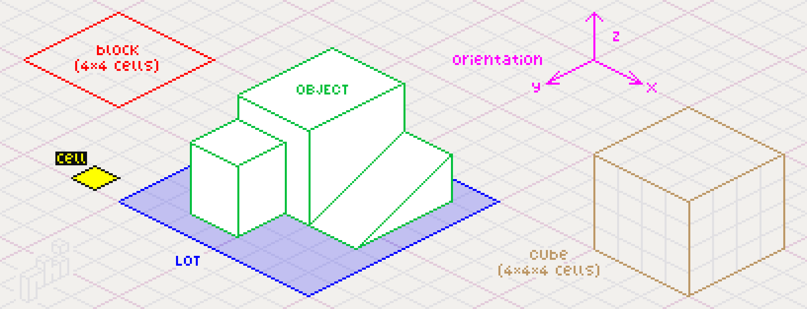
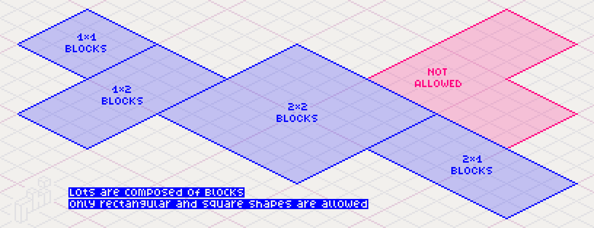
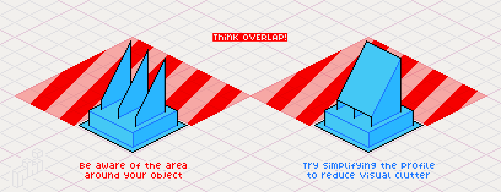
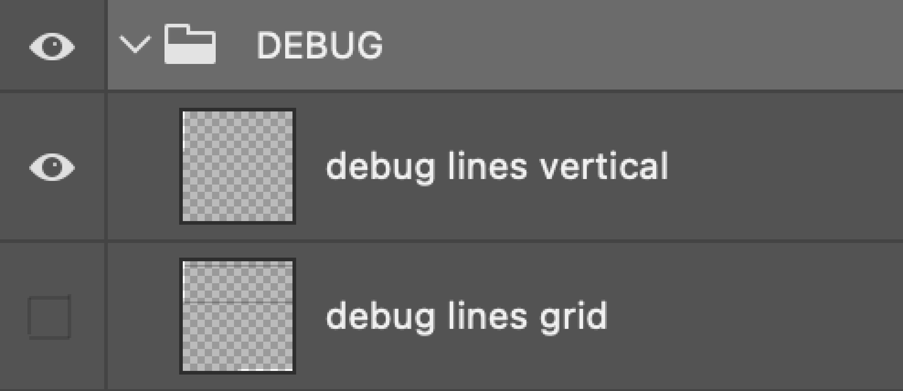
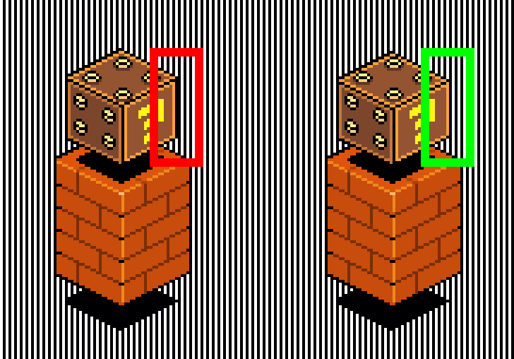
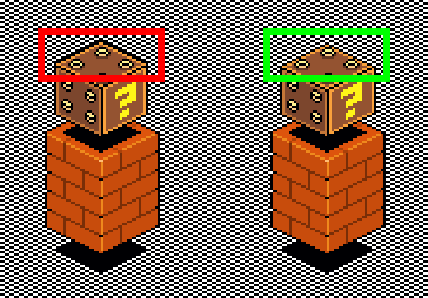
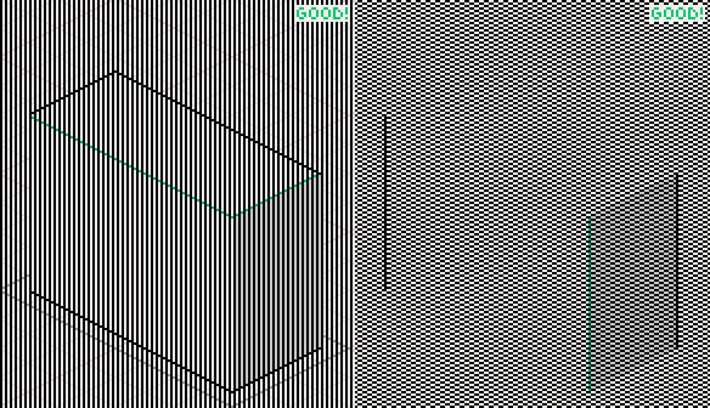

# Notes for Pixel Art Creators

## Check TiliX
Go check the [TiliX Reference on GitHub](https://c6y.github.io/tilix-reference/). Understand the grid system PHI is based on, and avoid some common pitfalls.

## Templates
* The latest [PHI templates](templates)
* [TiliX grid](https://github.com/c6y/tilix-reference/tree/master/media/assets)

## Nomenclature

## Lot Sizing

## Avoid Visual Noise

## Prepare for the Unknown

PHI creators should take into account that objects are modular and will be re-used in changing contexts. An object that looks beautiful by itself, might be hard to decipher if it is placed in front of another object. Below you'll find a couple of notes that might help mitigate these issues.

* Always test your object next and in front of other random objects.
* Keep things as simple as possible (but not boring). You never know how your objects will be used.
* Overlapping objects will increase the chance of visual noise.
* Be aware of negative space and the background of an object.
* The areas in the negative spaces of the structure should not be too complicated, or users might end up with visual clutter.
* Be aware of the cells behind the object that will be affected by its shape.
* Prefer closed shapes over open irregular shapes.
* You have more freedom with the parts of the object that are placed in front of its own ground area.
* If an object has an important area, focus the main action here, and prepare for users to cover the less important areas with other objects.
* Place a grid on top of your objects and check if all lines are in sync, remove any double lines.

## Other Things to Consider

* The correct relative scale between objects is not super important. A car or a house doesn’t have to be so big that it can hold a person. It just has to be understood to be a car, or a house. We create symbols, not an actual physical city.
* Avoid large boring sides. You can add detail, or slim down the size of an object by removing parts of it.
* Objects cannot be mirrored once they live in PHI. So be sure to check the correct location of vertical lines (see [Tilix > Do not mirror objects](https://c6y.github.io/tilix-reference/)).
* You can counter detailed objects with flat simple graphical objects. Both have their place in PHI Land.

## Debug your pixel lines

One useful way to spot problems, is to use the DEBUG layers provided in our Photoshop templates. Turn them on and spot lines that are out of sync. 

Check if your main vertical lines are in sync with the vertical grid:

Check if your grid lines are in sync with the grid:

<!--  -->

## Colors
* PHI-blue &nbsp; #8080ff &nbsp;
* PHI-red &nbsp; #ff8080 &nbsp;
* PHI-green &nbsp; #80ff80 &nbsp;
* PHI-paper &nbsp; #f2f0ed &nbsp;
